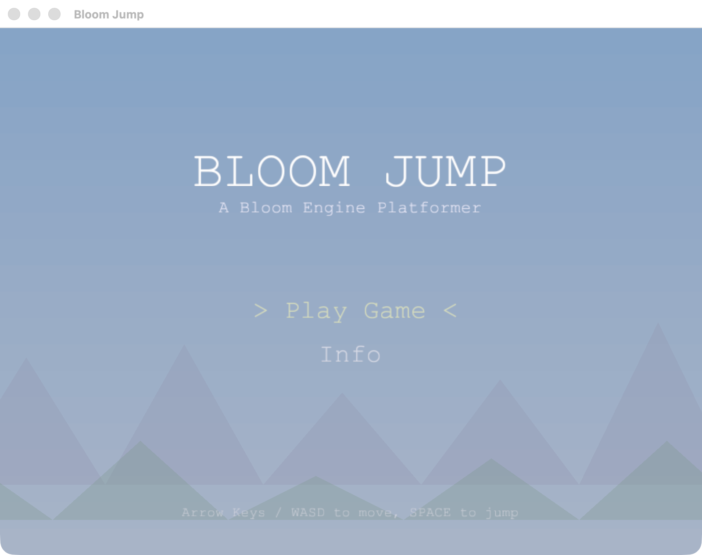
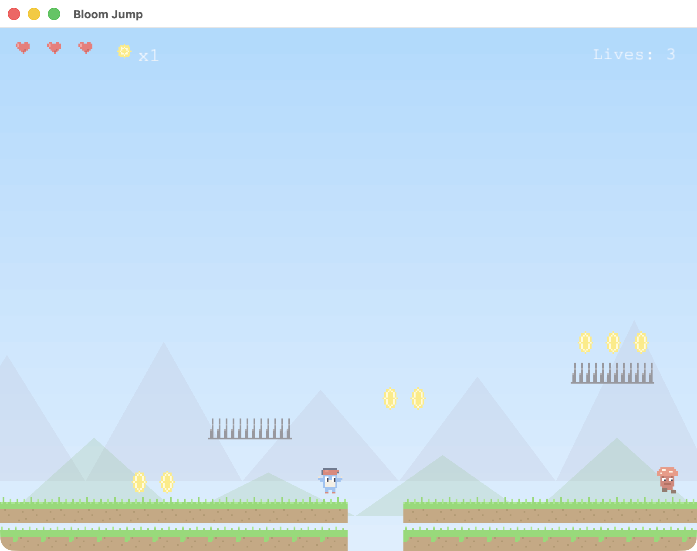
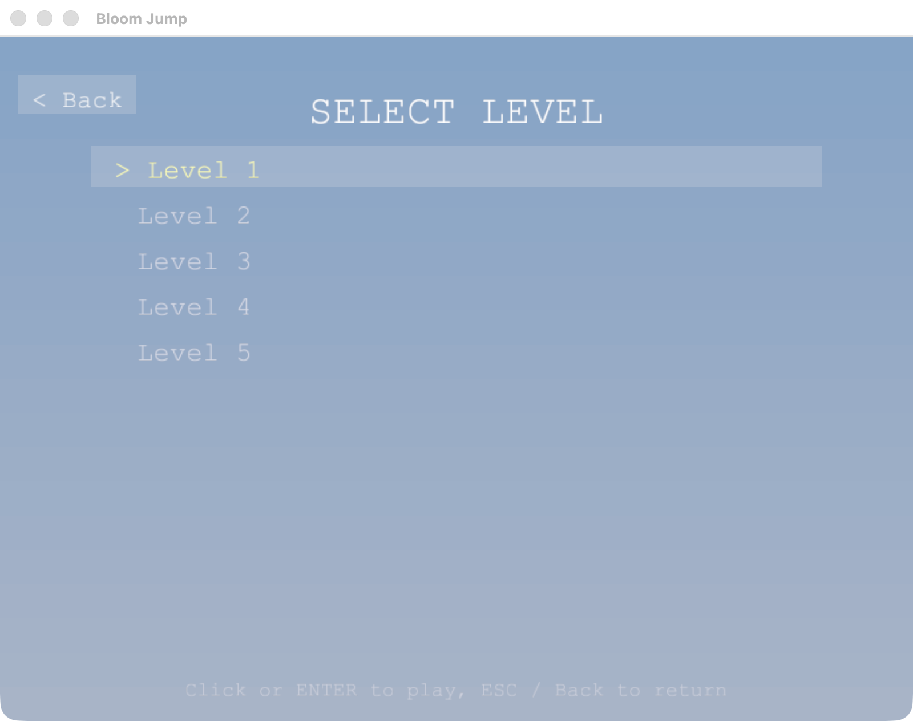
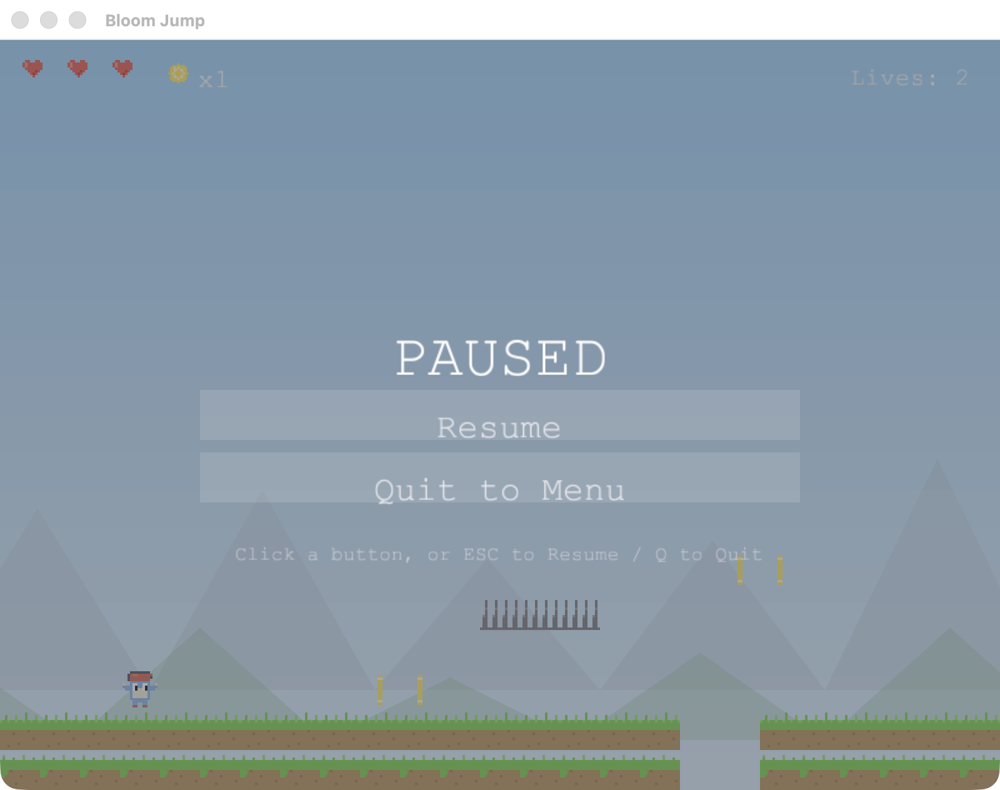
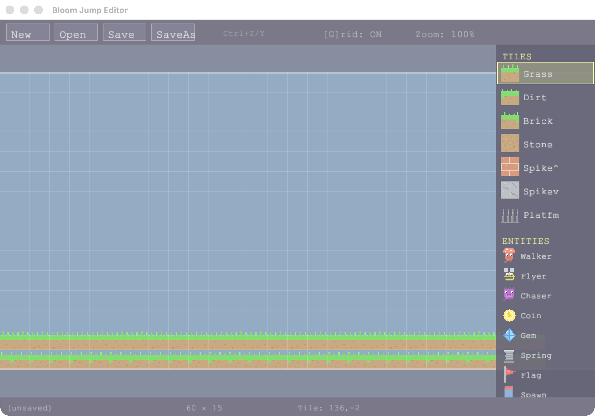

<div align="center">

# 🍄 Bloom Jump

**A classic 2D side-scrolling pixel-art platformer — written in pure TypeScript, compiled to native machine code.**

No VM. No interpreter. No garbage collector. One TypeScript file becomes a real native binary on macOS, Windows, Linux, iOS, tvOS, watchOS, Android, and the Web.



### 📲 Get it now

[**App Store**](https://apps.apple.com/us/app/bloom-jump/id6761447092) (iOS · macOS · tvOS · visionOS) · [**Apple Watch**](https://apps.apple.com/us/app/bloom-jump-watch/id6779528549) · [**Google Play**](https://play.google.com/store/apps/details?id=com.bloom.jump)

</div>

---

## ✨ What is this?

Bloom Jump is a complete, shippable platformer game built on two pieces of technology:

- **[Bloom Engine](https://www.npmjs.com/package/@bloomengine/engine)** — a native game engine for TypeScript with a Rust + `wgpu` rendering layer (sprites, audio, input, windowing).
- **[Perry](https://github.com/PerryTS/perry)** — a TypeScript-to-native compiler. It lowers TypeScript straight to machine code, so the game ships as a standalone native executable on every target.

The result is a full game — 5 levels, multiple enemy types, collectibles, a pixel-art renderer, sound and music, a title/menu flow, and a standalone level editor — that runs at a fixed 60 FPS with no runtime overhead.

---

## 📸 Screenshots

| Gameplay | Level Select |
|---|---|
|  |  |

| Pause | Level Editor |
|---|---|
|  |  |

---

## 🎮 Features

- **5 hand-designed levels** — *Green Meadows*, *Rocky Cliffs*, *Sky Gardens*, *Dark Caves*, *Final Heights*.
- **Pixel-art rendering** — a single sprite atlas drawn at 2× (16×16 → 32×32) with nearest-neighbour filtering for crisp pixels, plus parallax mountain/hill/cloud backgrounds.
- **Platformer physics** — separated-axis AABB collision, gravity, springs, one-way platforms, and coyote-friendly jumping at a fixed 60 FPS timestep.
- **Enemies & hazards** — walkers, flyers, chasers, and spikes. Stomp enemies from above or take damage.
- **Collectibles** — coins, gems, and a flag goal per level. Three lives, three hearts.
- **Audio** — generated sound effects and two music tracks (menu + gameplay).
- **Truly cross-platform input** — keyboard/mouse on desktop, touch controls on mobile, gamepad/Siri Remote on tvOS, and the Digital Crown on watchOS.
- **Standalone level editor** — paint tiles and entities, undo/redo, grid snap, save/load — see [Level Editor](#-level-editor).
- **Fullscreen** — press **F11** on any desktop platform.

---

## 🧠 How it works

### The compile pipeline

```
src/main.ts ──► Perry compiler ──► native object code ──► linked with ──► standalone
(TypeScript)     (TS → machine code)                       Bloom Engine      executable
                                                           (Rust + wgpu)
```

`src/main.ts` is the **entire game** in a single file. Perry compiles it to native object code and links it against the Bloom Engine's per-platform native library (`@bloomengine/engine/native/<platform>`). There is no JavaScript runtime in the output — the TypeScript *is* the program.

### Single-file, Perry-safe architecture

Both the game (`src/main.ts`) and the editor (`src/editor.ts`) are deliberately **single-file**. This avoids cross-module edge cases in the compiler and keeps the whole game in one translation unit. A few conventions make the TypeScript compile cleanly and run identically on every backend:

- **State lives in `const` arrays**, not module-level `let`. Player state is `const P = [...]`, game state is `const GS = [...]`, etc. Reading/writing array slots is stable across every Perry backend; module-level `let` mutation is not.
- **Float literals are explicit** (`0.0`, not `0`) so arithmetic stays in floating point.
- **Engine values are inlined** where a backend can't resolve imported `const`-object property access (e.g. key codes `K_SPACE = 32`), keeping the Web target working.
- **Index-based loops** (`for (let i = 0; ...)`) rather than `for…of`.

See [`CLAUDE.md`](CLAUDE.md) for the full list of compiler conventions.

### Game loop & state machine

The game is driven by `runGame(dt => { … })`, which the engine dispatches per platform (a `requestAnimationFrame` loop on Web, a native game loop elsewhere). Every frame:

1. Query screen size and compute a UI scale factor (so the HUD scales from phone to TV).
2. Update music stream and read platform input (touch / gamepad / crown).
3. Dispatch on the current state: **Menu → Level Select → Playing → Paused → Game Over → Level Complete → Credits**.

Gameplay updates run in fixed order each frame: `updatePlayer → updateEnemies → updateCollectibles → updateParticles → updateCamera`, then the world is drawn inside a 2D camera transform, followed by the HUD and any on-screen controls.

### Rendering

The game uses the engine's **Direct-2D mode** (`setDirect2DMode(true)`), which renders straight to the swapchain and skips the deferred 3D pipeline entirely — on mobile GPUs (e.g. Adreno) this is the difference between ~15 FPS and a locked 60. All sprites come from one atlas texture, so there are zero texture switches per frame. Several hot draw calls bypass the TypeScript wrapper objects and call the engine's FFI directly (`bloom_draw_texture_pro`, `bloom_draw_rect`, …) to avoid per-call allocations.

### Cross-platform input

| Platform | Input |
|---|---|
| **Desktop** (macOS/Windows/Linux) | Arrow keys / WASD + Space; **mouse** for menus; **F11** fullscreen |
| **iOS / Android** | Virtual joystick (left), jump button (right), pause (top-right) |
| **tvOS** | Gamepad / Siri Remote d-pad + button A; Menu to pause |
| **watchOS** | Digital Crown to move, tap to jump |

Platform detection comes from `isMobile()` / `isTV()` / `isWatch()`; touch state lives in a `TCH[]` array and gamepad state in `GP[]`, both refreshed each frame.

---

## 📁 Project structure

```
jump/
├── src/
│   ├── main.ts            # The entire game (single-file, Perry-safe)
│   └── editor.ts          # Standalone level editor (desktop-only)
├── assets/
│   ├── sprites/           # PNG sprite atlas + parallax backgrounds
│   ├── sounds/            # WAV sound effects + music
│   ├── levels/            # Level data (.txt) — level1…level5
│   └── icons/             # Per-platform app icons
├── tools/
│   ├── generate-assets.js # Regenerates ALL sprites + sounds (Node, no deps)
│   └── generate-icon.js   # Regenerates app icons
├── android/               # Android Gradle project (BloomActivity + JNI bridge)
├── build-android.sh       # Android: compile → APK → install
├── build-linux.sh         # Linux: build native crate → bundle Jolt → compile
├── build-web.sh           # Web: wasm-pack bundle
├── build-windows.bat      # Windows: vcvars + perry compile
├── .github/workflows/
│   └── release.yml         # CI: builds & ships every platform on a GitHub release
├── perry.toml             # Perry build + per-platform publish config
└── docs/screenshots/      # Images used in this README
```

---

## 🚀 Getting started

### Prerequisites

- **[Perry](https://github.com/PerryTS/perry)** compiler on your `PATH` (`perry --version`)
- **Node.js** (only to regenerate assets)
- Platform toolchains as needed (Xcode for Apple targets, Android SDK/NDK for Android, MSVC or LLVM for Windows)

### 1. Install dependencies

```bash
npm install
```

### 2. Generate assets (first run only)

```bash
node tools/generate-assets.js
```

This writes every sprite sheet and sound effect into `assets/` using only built-in Node modules — no image/audio libraries required.

### 3. Build & run

**macOS (desktop):**
```bash
perry compile src/main.ts -o jump && ./jump
```

**Level editor (desktop only):**
```bash
perry compile src/editor.ts -o editor && ./editor
```

**iOS Simulator:**
```bash
perry compile --target ios-simulator --features ios-game-loop src/main.ts -o bloom_jump
/usr/libexec/PlistBuddy -c "Delete :UIApplicationSceneManifest" bloom_jump.app/Info.plist
xcrun simctl install booted bloom_jump.app
xcrun simctl launch booted com.bloom.jump
```

**tvOS:**
```bash
perry compile --target tvos --features ios-game-loop src/main.ts -o bloom_jump_tv
```

**Android (build + install + run):**
```bash
./build-android.sh --run
```

**Linux:**
```bash
./build-linux.sh --run
```

**Windows** (from a Developer Command Prompt):
```bat
build-windows.bat
```
> The Windows build links with the **GUI subsystem** (`[windows] subsystem = "windows"` in `perry.toml`) so no console window opens alongside the game.

**Web:**
```bash
./build-web.sh
```

---

## 🗺️ Level format

Levels are plain-text files in `assets/levels/`:

```
name:Green Meadows
width:60
height:15
bg:0
spawn:3,12
tiles:0,0,0,1,1,1,...      # row-major grid, width × height entries
entities:1,20,12;10,30,12;20,95,12   # type,x,y separated by ;
```

**Tile types**

| ID | Tile | ID | Tile |
|---|---|---|---|
| 0 | air | 4 | stone |
| 1 | grass | 5 | spike-up |
| 2 | dirt | 6 | spike-down |
| 3 | brick | 7 | platform (one-way) |

**Entity types**

| ID | Entity | ID | Entity |
|---|---|---|---|
| 1 | walker | 11 | gem |
| 2 | flyer | 12 | spring |
| 3 | chaser | 20 | flag (goal) |
| 10 | coin | | |

---

## ✏️ Level Editor

`src/editor.ts` is a standalone desktop tool for authoring levels:

- **Tile & entity palette** (right panel) — pick grass/dirt/brick/stone/spikes/platforms and walker/flyer/chaser/coin/gem/spring/flag/spawn.
- **Paint** by clicking/dragging on the grid; **erase** with the air tile.
- **Undo / redo** (`Ctrl+Z` / `Ctrl+Y`), **grid toggle** (`G`), and **zoom**.
- **New / Open / Save / Save As** toolbar buttons read and write the same `.txt` format the game loads.

```bash
perry compile src/editor.ts -o editor && ./editor
```

---

## 🎨 Asset pipeline

All art and audio are **generated procedurally** by `tools/generate-assets.js` (pure Node — `fs`, `path`, `zlib` only):

- `assets/sprites/atlas.png` — the single 16×16 tile/sprite atlas (rendered at 2×).
- `assets/sprites/bg_*.png` — parallax mountain / hill / cloud layers.
- `assets/sounds/*.wav` — coin, gem, jump, stomp, hurt, death, spring, complete, select.
- `assets/sounds/music_*.wav` — menu and gameplay music.

Re-run `node tools/generate-assets.js` after editing the generator to refresh everything.

---

## 📦 Releasing (going live)

Shipping is driven by **`.github/workflows/release.yml`**, triggered when a **GitHub Release is published**. Each platform builds in parallel and ships to its store/channel via `perry publish`:

| Job | Target | Destination |
|---|---|---|
| iOS | `perry publish ios` | TestFlight → App Store |
| tvOS | `perry publish tvos` | TestFlight → App Store |
| watchOS | `perry publish watchos` | TestFlight → App Store |
| macOS | `perry publish macos` | App Store + notarized DMG (attached to the release) |
| Android | `perry publish android` | Google Play |
| Windows | `perry publish windows` | GitHub release asset |
| Linux | `perry publish linux` | GitHub release asset |
| Web | `wasm-pack` bundle | `bloomengine.dev/jump` |

The workflow installs Perry, injects the version/build number from the release tag, decodes signing credentials from repository secrets, and publishes. Per-platform signing identities, bundle IDs, and distribution channels are configured in **`perry.toml`**.

> **To cut a release:** tag a version (`vX.Y.Z`), publish a GitHub Release, and the workflow fans out to every platform.

---

## 🛠️ Perry compiler notes

Because the game compiles straight to native code, a few TypeScript patterns are written defensively. The most important:

- `Math.max` / `Math.min` / `Math.pow` may return boxed objects — compute inline instead.
- Integer literal `0` infers `i32`; use `0.0` for float math.
- Prefer `const` arrays for mutable state over module-level `let`.
- Use index-based loops, not `for…of`.
- Compare strings with numeric constants + `if/else`, not `switch` on strings.

The full, current list lives in [`CLAUDE.md`](CLAUDE.md).

---

## 📜 Credits & license

**Bloom Jump** © 2026 **Skelpo GmbH**. All rights reserved.

Built with **Bloom Engine** · Compiled with **Perry**.

> *No frameworks were harmed in the making of this game. Pure TypeScript. Compiled to native. No VM. No interpreter. No GC.*
